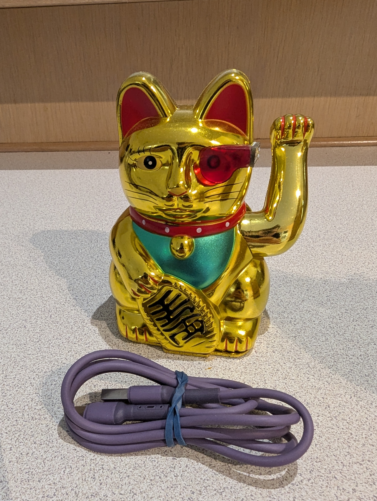
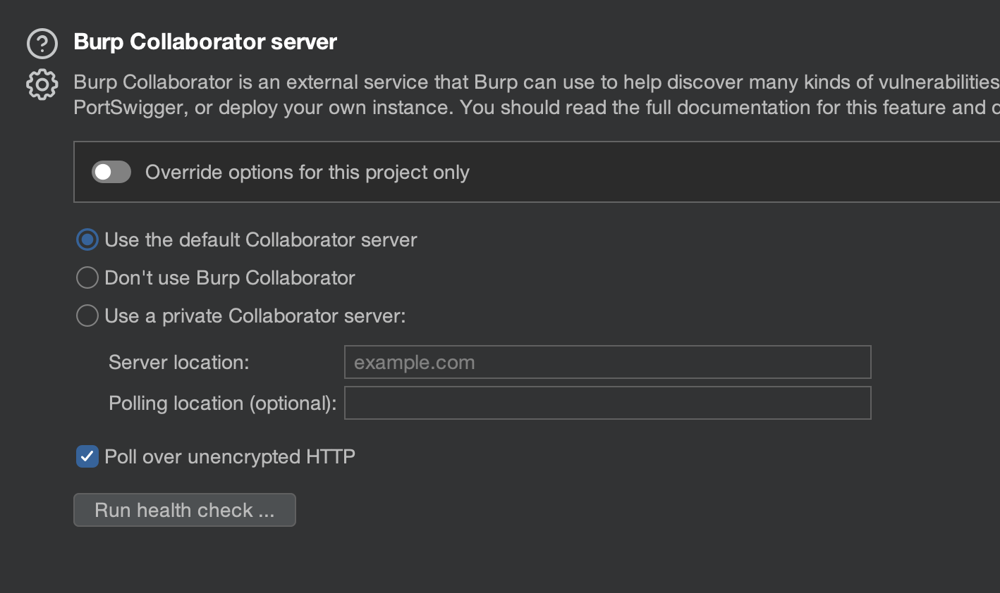
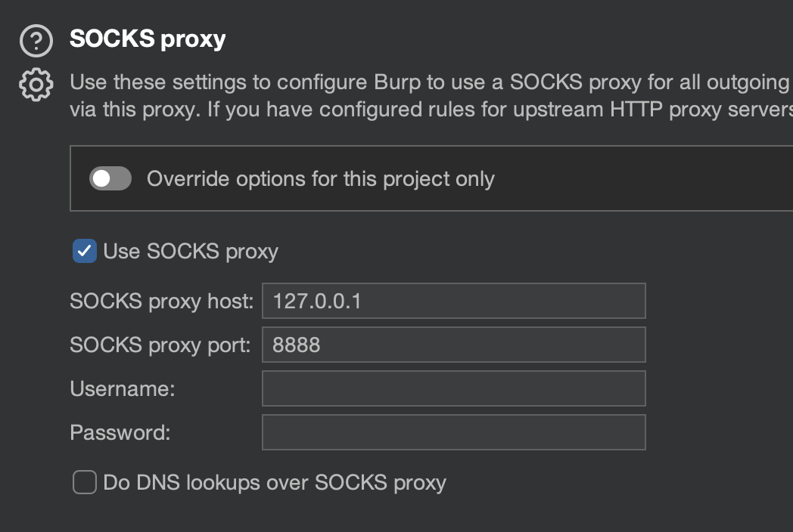
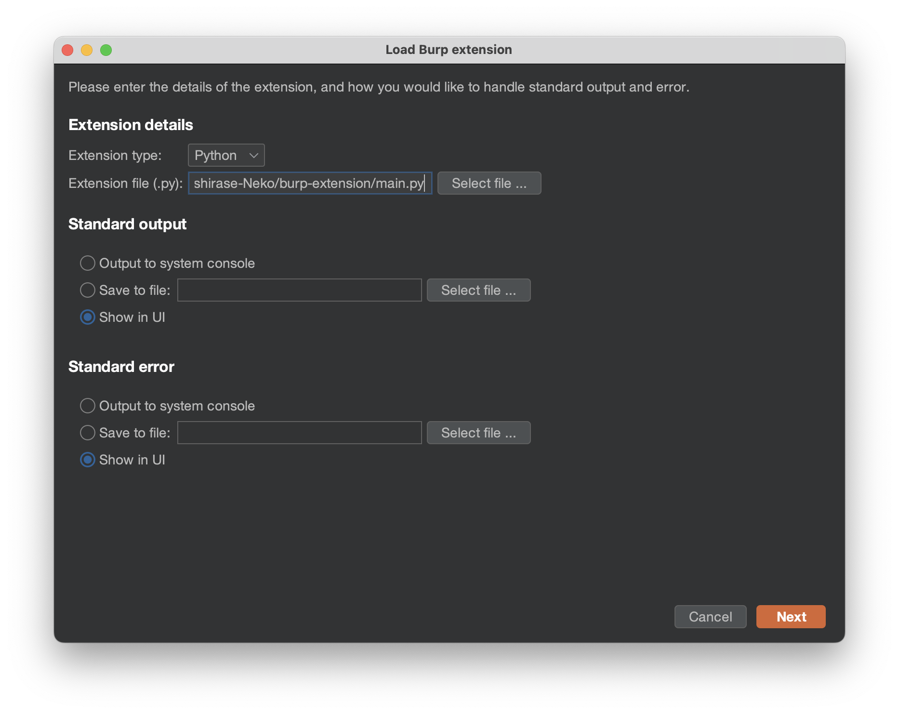
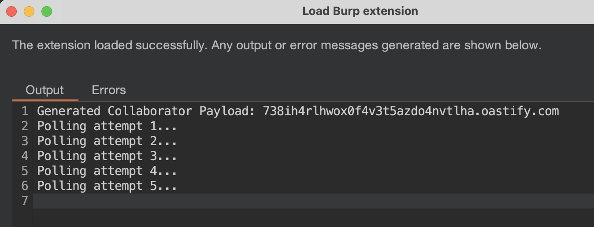
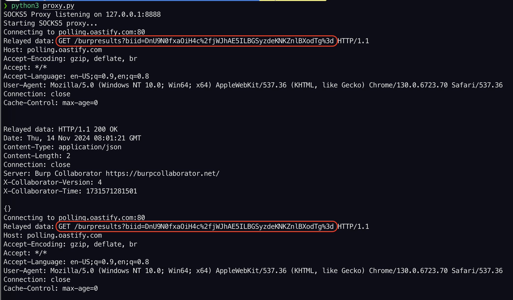
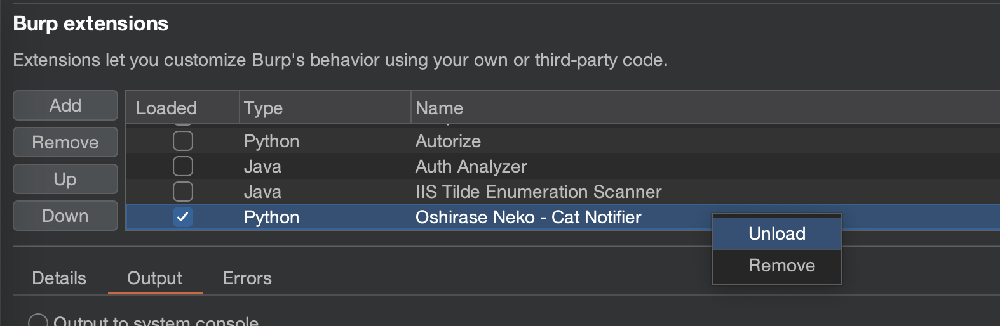
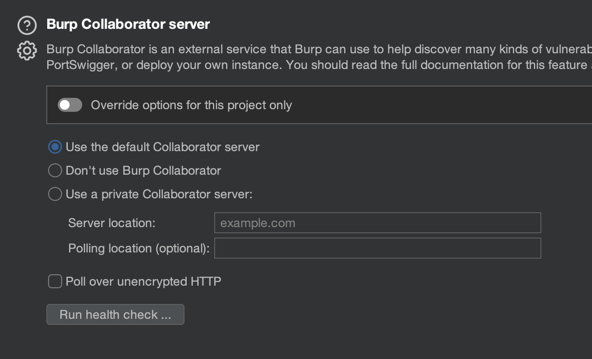

# Oshirase Neko

"Oshirase Neko" (Cat Notifier) is a custom notification device that combines the iconic Maneki Neko (beckoning cat) with an ESP32 microcontroller. This device is designed to detect potential Server-Side Request Forgery (SSRF) vulnerabilities by polling a Burp Collaborator server for interactions. When the cat waves its paw, it signals that the device has detected an interaction with the Collaborator server, indicating a potential SSRF vulnerability. However, not all SSRF vulnerabilities are exploitable. By incorporating the Maneki Neko, the device adds a touch of good fortune, symbolizing the unpredictable nature of bug hunting and serving as a reminder that luck often plays a role in uncovering vulnerabilities.



# Setup

## Step 1: Configure Burp Collaborator

1. Open Burp Suite and navigate to Collaborator Settings.
2. Check the box labeled "Poll over unencrypted HTTP".




## Step 2: Monitor HTTP Requests for the Collaborator BIID

If you are using an upstream proxy server, you can use a packet capture tool like tshark to monitor HTTP requests for the Collaborator BIID (Burp Interaction ID).

```bash
sudo tshark -Y http -T fields -e http.request.method -e http.request.uri -e http.host -e http.request.uri
```

If you don't use an upstream proxy server, you can use the [proxy python script](/Oshirase-Neko/misc/proxy.py) to intercept requests from Burp Suite and extract the Collaborator BIID value. 

```bash
python3 proxy.py
```

You'll need to configure the upstream proxy in Burp Suite to `127.0.0.1`, port `8888`: 




## Step 3: Add the Oshirase Neko Burp Extension

1. Add the [Oshirase Neko burp extension](/Oshirase-Neko/burp-extension/main.py) to burp.



2. Once successfully added, the extension will run automatically, polling the Collaborator server five times by default. If you need to run it again later, load the extension manually.



3. Check the output of your tshark packet capture on your upstream proxy server for the five sequencial requests made by the extension and note down the `biid` value. The Burp Interaction ID (biid) is a unique identifier associated with each Collaborator payload. Learn more about biid [here](https://www.richardosgood.com/posts/burp-suite-collaborator-recovery/). 

This should look something like:

```bash
GET        polling.oastify.com    /burpresults?biid=DnU9N0fxaOiH4c%2fjWJhAE5ILBGSyzdeKNKZnlBXodTg%3d
GET        polling.oastify.com    /burpresults?biid=DnU9N0fxaOiH4c%2fjWJhAE5ILBGSyzdeKNKZnlBXodTg%3d
GET        polling.oastify.com    /burpresults?biid=DnU9N0fxaOiH4c%2fjWJhAE5ILBGSyzdeKNKZnlBXodTg%3d
GET        polling.oastify.com    /burpresults?biid=DnU9N0fxaOiH4c%2fjWJhAE5ILBGSyzdeKNKZnlBXodTg%3d
GET        polling.oastify.com    /burpresults?biid=DnU9N0fxaOiH4c%2fjWJhAE5ILBGSyzdeKNKZnlBXodTg%3d
GET        polling.oastify.com    /burpresults?biid=DnU9N0fxaOiH4c%2fjWJhAE5ILBGSyzdeKNKZnlBXodTg%3d
```

Or if you use the [proxy.py](/Oshirase-Neko/misc/proxy.py) script, then you should see the GET requests in the output. For example:



**Note**: Each Collaborator instance (referred to as a "client" in Burp) can only be polled by one source at a time. This means that if both Burp Suite and Oshirase Neko are polling the same Collaborator instance, only one will receive the results, as interactions are cleared after each successful polling event. To avoid interference with Burp's built-in Collaborator client, the Oshirase Neko Burp extension creates a dedicated Collaborator instance. This ensures that each polling source operates independently.

4. You can now unload the Oshirase Neko extension.




## Step 4: Reconfigure Burp Collaborator

Return to Collaborator Settings in Burp Suite and uncheck "Poll over unencrypted HTTP" to restore secure polling.




## Step 5: Update the Oshirase Neko Config File

Open the [Oshirase Neko config file](/Oshirase-Neko/config.ini).

Update the following settings:

- `polling-endpoint`: Use the Collaborator payload generated by the Oshirase Neko Burp extension.
- `proxy`: Specify the Spider proxy settings.
- `port`: Set the correct port for the serial connection to the ESP32 device. On macOS, list available ports with: `ls /dev/cu*`.


## Step 7: Run the Oshirase Neko Python Script

Run the main [Oshirase Neko python script](/Oshirase-Neko/OshiraseNeko.py):

```bash
python3 Oshirase-Neko/OshiraseNeko.py
```

The Oshirase Neko will now start monitoring Collaborator interactions and notify you by waving the Maneki Neko’s paw.

Remember that you need to use the Collaborator payload that was given as an output from the Oshirase Neko burp extension to get notifications via the Maneki Neko.

You can watch the video of Oshirase Neko in action here: 

[](https://www.youtube.com/watch?v=eBev7EduBZg)
