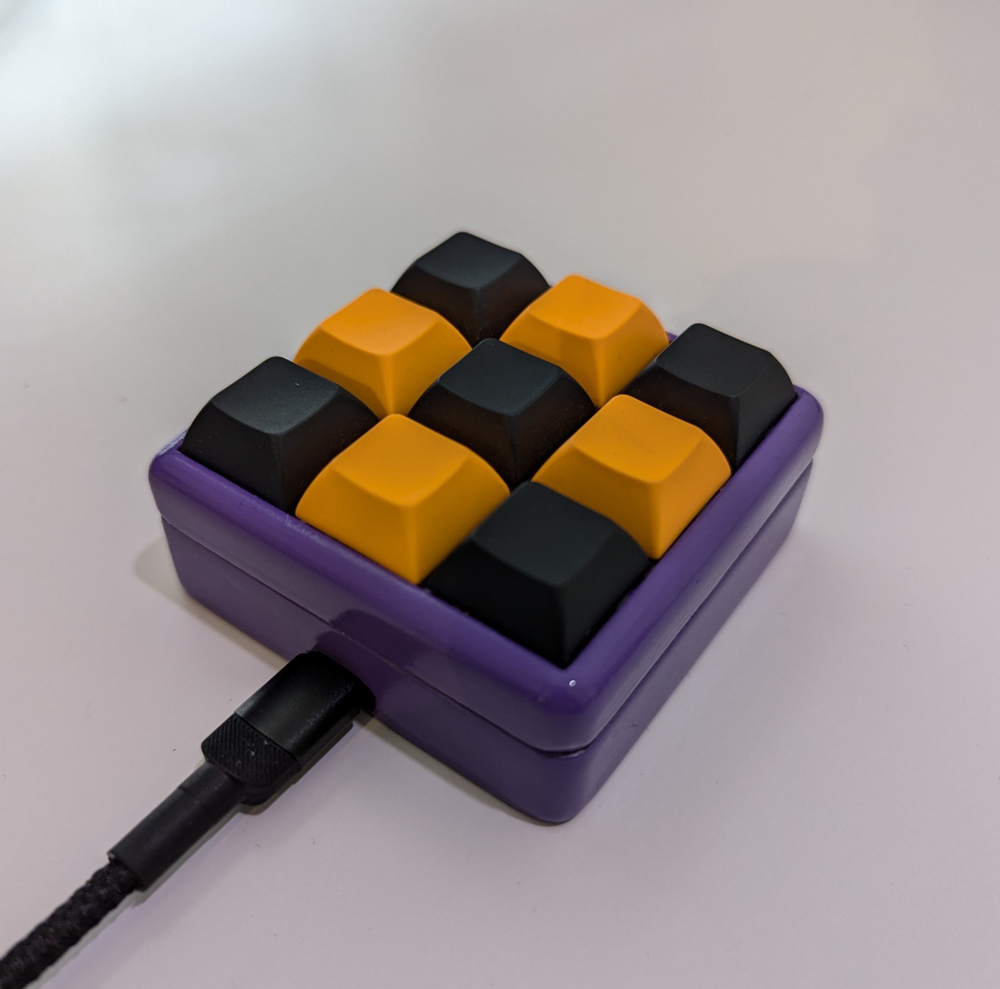

# Plunder-Pad

A custom 9-key macro pad for Burp Suite. It allows you to switch between and send requests to Repeater, Intruder, and Proxy. It also supports encoding and decoding requests, toggling request interception, and forwarding requests.

This uses [kmk](http://kmkfw.io/) keyboard firmware and was a secret santa gift for a work colleague.

3D Printed case is from [thingiverse](https://www.thingiverse.com/thing:4816077) - but needed a bit of cutting / shaping to fit the usb-c port properly.

Layer 1 and 2 have the following key mappings:

