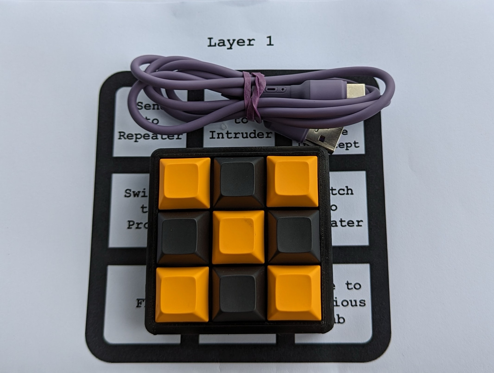
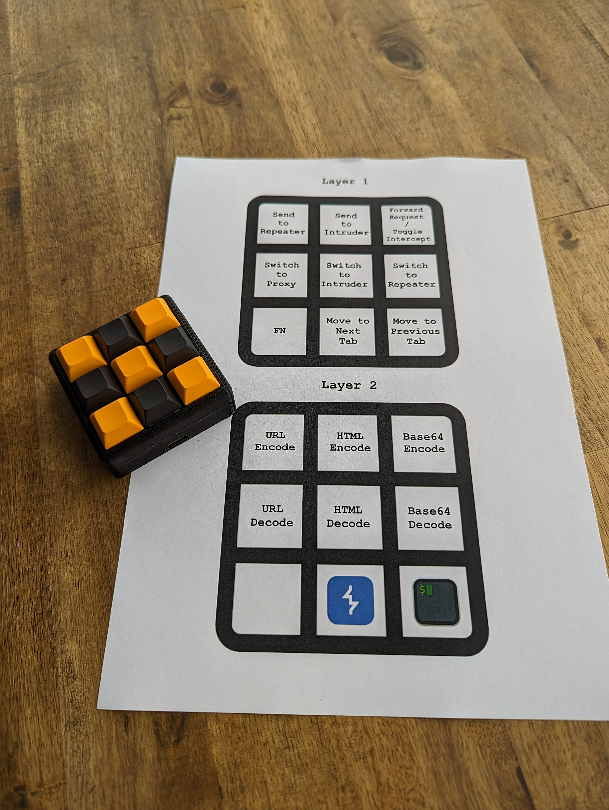
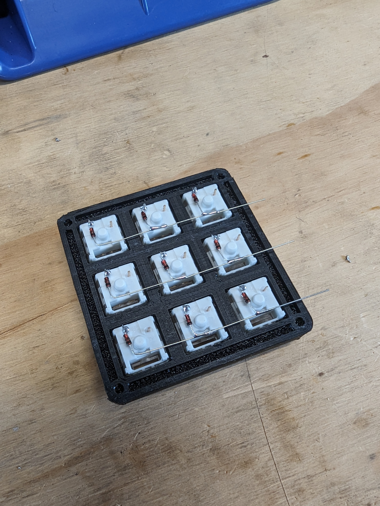
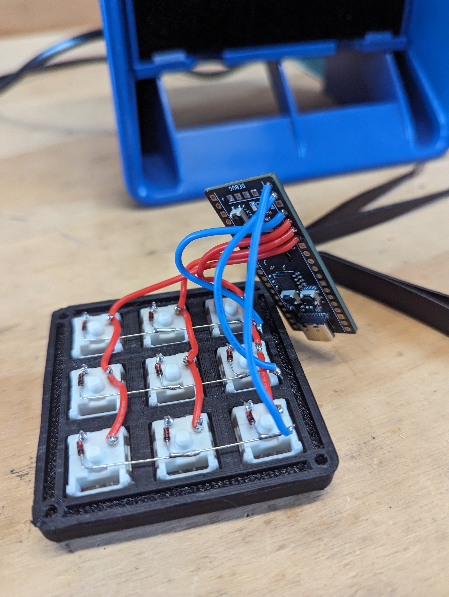

# Plunder-Pad

A custom 9-key macro pad for Burp Suite built using a Raspberry Pi Pico (RP2040) and [kmk](http://kmkfw.io/) keyboard firmware. It allows you to switch between and send requests to Repeater, Intruder, and Proxy. It also supports encoding and decoding requests, toggling request interception, and forwarding requests.

3D Printed case is from [thingiverse](https://www.thingiverse.com/thing:4816077) - but needed a bit of cutting / shaping to fit the usb-c port properly.

Layer 1 and 2 have the following key mappings:

Wiring is pretty simple, you just need to put a diode between each key on the row. Columns don't require any diode.

